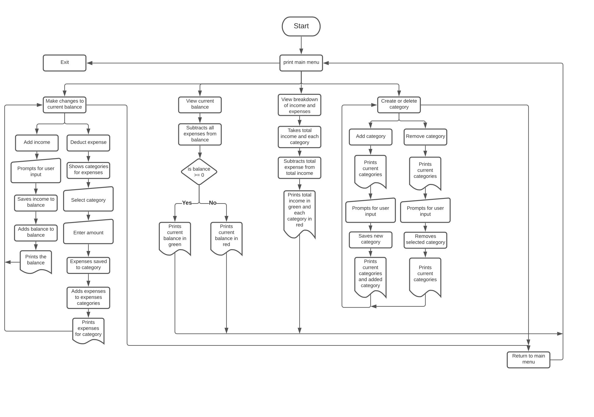

# Statement of purpose and scope

## Name of Application: FinView (Finance View)

### URL: https://github.com/magikmaxx/T1A3/tree/master

## Installation

To run Finview

1. Open the terminal
1. Ensure that you are within root folder of project
1. Type in: bash finview.sh

### Problem Identification

In our day to day lives it is quite easy to spend money and the next time we look at our bank accounts we ask ourselves “where did all of my money go?”. The technology we have today such as PayWave, Apple Pay, Google Pay, all make it easy for people to spend money without thinking about it. Being able to casually tap your card or smartphone onto a device, makes it easy for people to spend their income without keeping track of their finances. To help with that issue, a basic finance application was created.

### Description

FinView gives users the opportunity to better track their earnings and spending. FinView does this by showing the users where they have spent their money on, and it can also provide the user with a more detailed overview. Whether the user has spent money on social gatherings, groceries, bills, or rent they will be able to see where their biggest monthly spending is coming from. Creating or removing categories allows the user to tailor the application to their liking.

### Target Audience

The target audience for FinView is anyone who wants to better understand where they are spending their money. It can also help users determine where they can reduce spending. By breaking down the monthly spending into separate categories will clearly show the user how much they have spent for that specific category in that month.

### Interaction with FinView

FinView will first display a welcome message that explains to the user what FinView is and how it can benefit their daily lives. The user will be able to select different things in the Menu. The Menu includes:

1.  Enter current Balance
1.  Make changes to current balance
1.  View current balance
1.  View expenditure breakdown
1.  Create a category

When the user receives their wages or when they are required to pay a bill, they can easily enter those amounts into FinView and FinView will easily and calculate what the user has left. The user will have seamless experience with the app because it is intuitive and straight forward. The titles on the menu tell them exactly what each menu button does, and they will be guided step-by-step so that the experience and interaction they have with FinView is done with ease and without stress.

## Features

#### Make changes to current balance

1. Add Income
1. Subtract Expenses

In Add Income the user is able to add to their income. When they open Add Income, they will type in a number that will then add to their total balance.
When selecting Subtract Expenses the user will be able to type in a number that will later subtract from their total balance. Before entering an expense they will need to select a category, this will help the user make sense of where they have made expenses.

#### View Current balance

Viewing the current balance will show the user their current balance, where the entered balance is subtracted from their expenditure. This is a quick view which only shows them the balance without any kind of breakdown. To also make it easily recognizable whether they have a positive or negative balance, it will be shown in green or red respectively.

#### View expenditure breakdown

When the user selects this option, they will be able to see a breakdown of their expenses including their current balance.
When the user selects this, they will be able to see exactly in what categories they have spent the most and this can help them make better decisions on their spending habits. Any expenses are shown in red and any income or positive numbers are shown in green.

#### Create a category

Should there be a category that is not included in FinView, the user will be able to easily create their own category and this gives the user freedom, because they will not be restricted with the categories that FinView provides them. With greater flexibility, the user can better organize and makes sense of their finances due to better categorization.

### Control Flow

### Trello

Placed deadlines for things when it got very close to the deadline.

When I made some changes to something I noted it in the Trello board so that I can see that theses changes were planned.

The menu was different before and the changes have been noted on Trello.

Deadlines have been added to certain parts as well.

When all tasks have been completed and double checked the labels were changed to only a color green. Only having the color green indicates that the everything has been checked. Red and Green labels indicate that it has been completed but not fully checked.
Since everything has been checked and completed, the labels will only be green.

